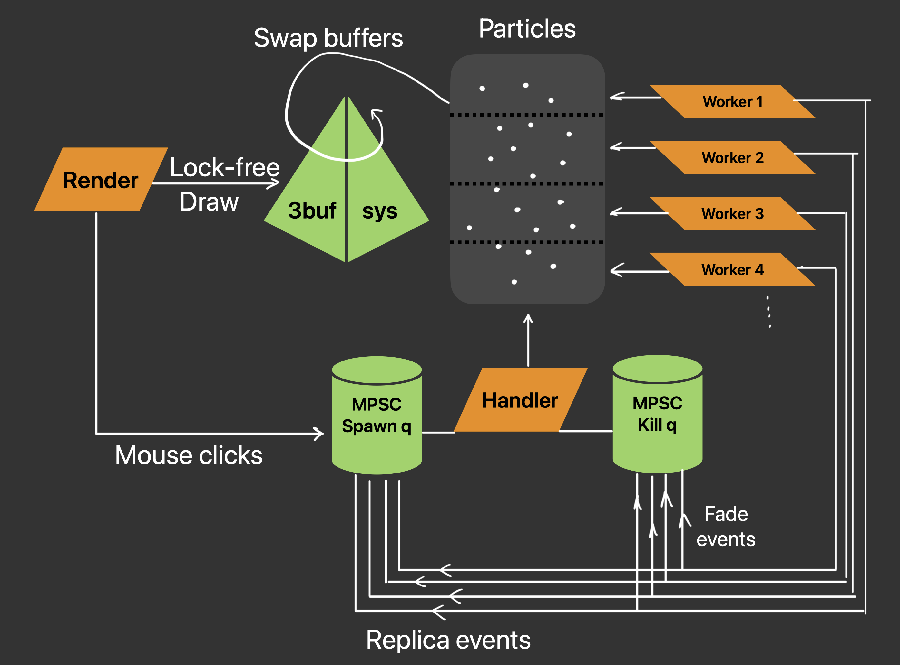
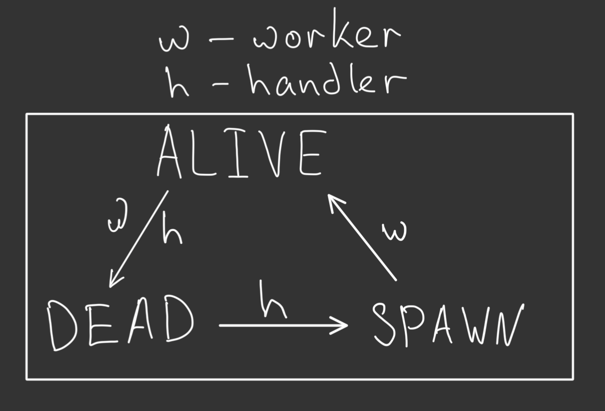
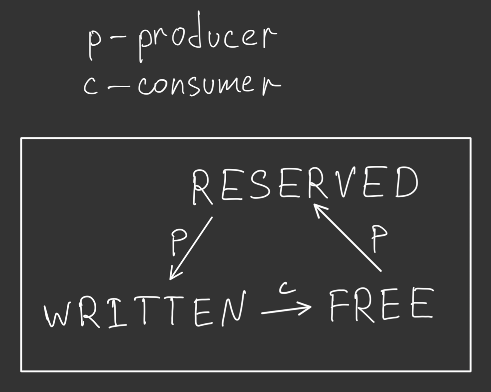

# Particler

## Что это?
Небольшой проект физического движка, где можно выделить:
* Независимый расчёт физики
* Многопоточная система воркеров, обработчика и рендера
* Lock-free структуры данных и алгоритмы
* Высокая производительность и масштабируемость

## Архитектура

Система состоит из нескольких потоков взаимодействующих неблокирующим образом так, чтобы положения частиц в 3buf-system могли непрерывно обновляться симулируя реальное независимое поведение материальных точек.
Например:
* render и workers "сообщаются" статусами частиц и стейтом 3-буфера
* render и handler "сообщаются" посредством MPSC очереди
* workers и handler "сообщаются" не только посредством очередей, но и атомарными состояниями частиц
* и др.

Рассмотрим основные компоненты:
1. Render thread
2. Handler thread
3. Worker threads
4. Particles data + LL
5. MPSC queues
6. 3-buf draw system
#### 1. Render
Поток рендера является главным. Что делает:
0. инициализирует всю память движка и запускает прочие потоки
1. вызывает колбеки на клики мыши, пишет в `spawn_q`
2. читает 3buf-system, получая свежее раположение точек
#### 2. Handler
Выполняет функцию координатора, забирая на себя минимальные необходимые задачи:
1. удаляет устаревшие частицы (храня их в стеке)
2. запускает в симуляцию новые (беря из стека)
3. поддерживает сортированный двусвязный список активных частиц для быстрого удаления самых старых частиц за O(1) при over-spawn
#### 3. Workers
Каждый воркер принимает на себя просчёт симуляции части частиц. По существу:
1. сообщает хендлеру кого выключить (lifetime, outscreen)
2. сообщает кого реплицировать в новую вспышку
3. пишет в 3buf-system
#### 4. Particles data
Частицы представляют собой заранее выделенную SoA (cache-friendly структуру), так же содержащую двусвязный список на индекс (для быстродействия). В основе неблокирующей синхронизации потоков лежит FSM состояний частицы:

#### 5. MPSC queues
Собственная реализация неблокирующей очереди с множеством продьюсеров. В основном базируется так же на FSM состояний ячеек и кольцевом буфере. Граф:

#### 6. 3-buf draw system
Ключевой идеей этой работы явно стали конечные автоматы ☺️ Самый большой из них лежит в основе 3-буферной системы, призванной достичь неблокирующего сообщения между физикой и рендером. Основная идея: есть 3 буфера, 1 всегда принадлежит рендеру (R), а 2 других — физике (i/o), и за счёт атомарных циклических переключений физика может обновлять себя (прыжки одноцветных кубиков), а рендер себя (прыжки на белые кубики).
FSM:

Граф выглядит довольно трудным, но в действительности можно просто выделить 2 основных подмножества состояний:
1. await reading
2. await switching

## P.S.
Хочется подчеркнуть, что я старался полностью избегать спин-локов на CAS операциях, предусматривать live-локи, выжимать максимум из железа.
Работа выполнена полностью самостоятельно, без использования сторонних статей. Единственный помощник — нейронка, на подумать.
Наброски мышления по задаче можно посмотреть [здесь](./MindDrafts.pdf)